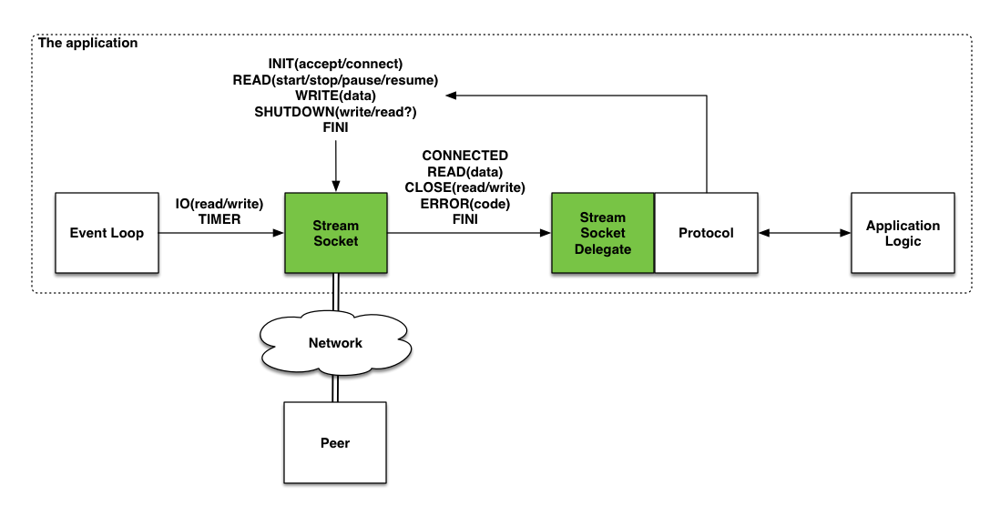

# Frame transporter

The high-performance networking library for C and POSIX aka libft.

## Features

* High-speed event loop ([libev](http://software.schmorp.de/pkg/libev.html))
* Event driven [Network socket](https://en.wikipedia.org/wiki/Network_socket) abstraction
* Non-blocking I/O or [asynchronous I/O](https://en.wikipedia.org/wiki/Asynchronous_I/O)
* SSL/TLS encryption by [OpenSSL](https://www.openssl.org)
* Fixed-size block memory pool
* Tracing, logging and auditing

## The concept

  

Stay tuned, more (e.g. the proper documentation) to come in a near future.

## Copyright and License

Copyright (c) 2016-2017, TeskaLabs Ltd, [Ales Teska](https://github.com/ateska)  
The project is released under the BSD license.

---

